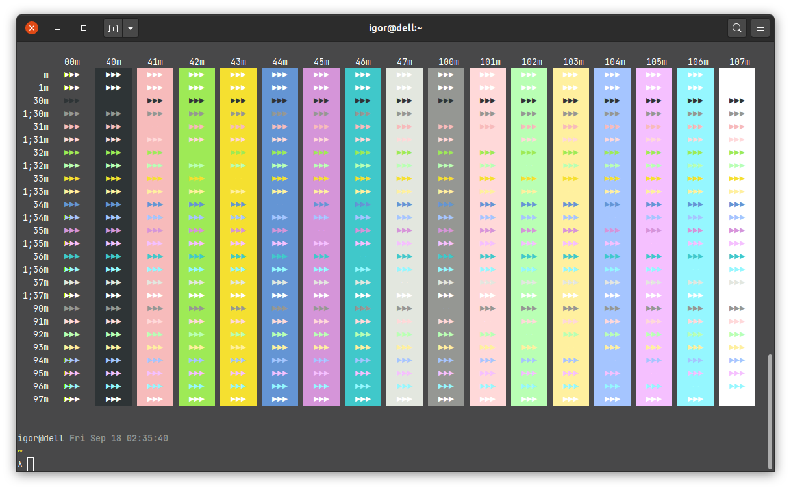
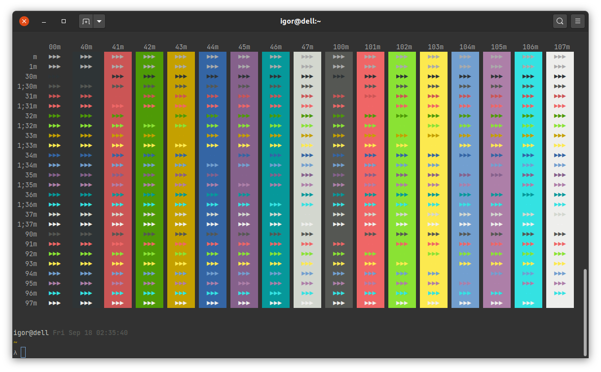

Garlic
======

This is a dark color theme for Gnome Terminal for working under the sunlight.
It is designed to be visible even in enormously bright environment.

Garlic Sun
----------

Garlic Moon
-----------
There is also Garlic Moon theme with normal brightness

Installation
------------

    git clone https://github.com/igrmk/garlic.git
    cd garlic
    ./install.sh

Tips for working on plain air
-----------------------------

1. Wear dark.
   Your screen will reflect your bright clothes.
   Even a matte display won't help if the sun will be shining on your white T-shirt.
2. Try to find a shadow.
   But try to not use trees.
   A lot of trees produce tiny drops of a resin.
   They are hard to clean from your screen.
3. Set the brightness level to the maximum.
4. Have a cleaning cloth with you. A dust is very distracting in the sun.
